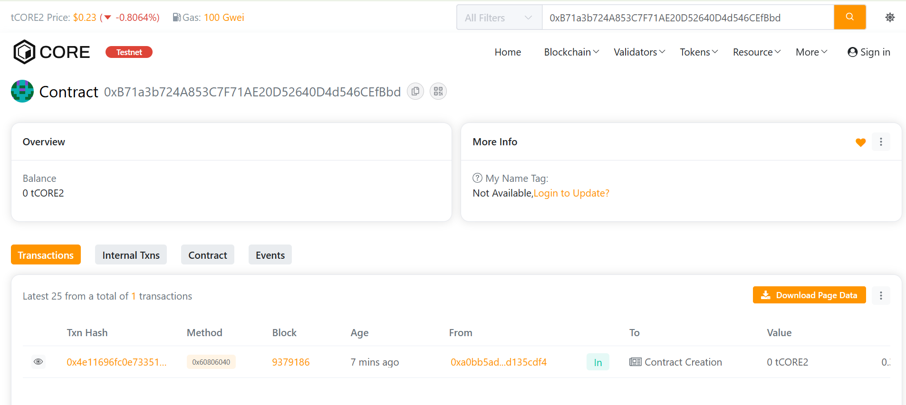

# DeFiStrand

## Project Description

**DeFiStrand** is an innovative decentralized finance (DeFi) platform that revolutionizes how users interact with yield generation and liquidity management. By weaving together multiple DeFi primitives into interconnected "strands," the platform creates a sophisticated ecosystem where users can deposit funds, earn yield based on risk tolerance, and participate in liquidity pools—all within a single, streamlined interface.

Each strand represents a unique investment strategy with customizable risk levels (1-10), allowing users to choose their preferred risk-reward ratio. The platform automatically calculates and distributes yield based on deposit duration, amount, and the strand's risk level, creating a dynamic and fair reward system.

DeFiStrand combines the best aspects of:
- **Yield Farming**: Automated yield generation with competitive rates
- **Liquidity Provision**: Create and manage liquidity pools for token pairs
- **Risk Management**: Transparent risk levels for informed decision-making
- **Portfolio Diversification**: Multiple strands for different strategies

## Project Vision

Our vision is to become the leading interconnected DeFi ecosystem that makes sophisticated financial strategies accessible to everyone. We aim to:

🌐 **Democratize DeFi**: Make complex financial instruments simple and accessible to retail users  
🔗 **Create Interconnectivity**: Build a web of financial primitives that work seamlessly together  
📈 **Optimize Yields**: Provide superior returns through intelligent capital allocation  
🛡️ **Ensure Security**: Implement robust security measures and emergency mechanisms  
🌱 **Foster Growth**: Build a sustainable ecosystem that benefits all participants  
🚀 **Drive Innovation**: Continuously evolve with cutting-edge DeFi technologies  

We envision a future where:
- Users can seamlessly navigate between different yield strategies
- Capital flows efficiently to where it generates the most value
- Risk is transparent, measurable, and manageable
- DeFi becomes the default choice for wealth generation
- Financial inclusion becomes a reality for billions worldwide

## Key Features

### 🎯 Core Functionality

#### 1. **Strand Creation & Management**
- Create custom DeFi strands with unique names
- Set risk levels from 1-10 for different investment strategies
- Track total deposits, yield generated, and activity status
- Immutable creator attribution with timestamp tracking
- Deactivation mechanism for lifecycle management

#### 2. **Intelligent Yield Generation**
- **Base Yield Rate**: 5% annual percentage yield (APY)
- **Risk Multiplier**: Higher risk strands generate higher yields (up to 2x)
- **Time-Based Accrual**: Yield calculated per second for fairness
- **Automatic Compounding**: Yield accrues continuously
- **Gas-Efficient Claims**: Optimized for minimal transaction costs

**Yield Formula:**
```
Yield = (Deposit × Rate × Time × Risk Multiplier) / (365 days × 10000)
Risk Multiplier = (100 + Risk Level × 10) / 100
```

#### 3. **Liquidity Pool Integration**
- Create liquidity pools for any token pair
- Track reserves and total liquidity in real-time
- Built-in 0.3% trading fee mechanism
- Support for multiple pools simultaneously
- Cross-strand liquidity utilization

### 🔒 Security Features

- **ReentrancyGuard**: Protection against reentrancy attacks
- **Pausable**: Emergency pause mechanism for critical situations
- **Access Control**: Owner-only functions for sensitive operations
- **Emergency Withdrawal**: Users can withdraw deposits anytime
- **Input Validation**: Comprehensive checks on all user inputs
- **Safe Math**: Using Solidity 0.8.20+ built-in overflow protection

### 📊 Advanced Tracking

- **Total Value Locked (TVL)**: Real-time protocol-wide TVL tracking
- **User Positions**: Detailed position tracking per user per strand
- **Yield History**: Complete history of yield generation and claims
- **Multi-Strand Support**: Users can participate in multiple strands
- **Liquidity Metrics**: Comprehensive pool statistics and analytics

### 💎 User Experience

- **Minimum Deposit**: Only 0.01 ETH to start
- **Instant Deposits**: Immediate position activation
- **Real-Time Yield**: View accrued yield without claiming
- **Flexible Withdrawals**: Emergency withdrawal option available
- **Event Emission**: Complete transparency through blockchain events

## Future Scope

### Phase 1: Enhanced Core Features (Q1 2025)
- ✅ **Auto-Compounding**: Automatic reinvestment of claimed yields
- ✅ **Strand Templates**: Pre-configured strands for common strategies
- ✅ **Referral System**: Reward users for bringing new participants
- ✅ **Multi-Token Support**: Accept various tokens beyond native currency
- ✅ **Advanced Analytics Dashboard**: Comprehensive performance metrics

### Phase 2: Advanced DeFi Integration (Q2 2025)
- 🔄 **DEX Integration**: Direct token swaps within strands
- 🏦 **Lending Protocols**: Collateralized loans using strand positions
- 📊 **Yield Optimization**: AI-powered yield maximization strategies
- 🎲 **Insurance Pools**: Optional insurance for risk mitigation
- 🌉 **Cross-Chain Bridge**: Support for multiple blockchain networks

### Phase 3: Governance & DAO (Q3 2025)
- 🗳️ **Governance Token**: STRAND token for protocol governance
- 🏛️ **DAO Formation**: Community-driven decision making
- 💰 **Revenue Sharing**: Protocol fee distribution to token holders
- 📋 **Proposal System**: On-chain voting for protocol upgrades
- 🎖️ **Reputation System**: Reward long-term participants

### Phase 4: Institutional Features (Q4 2025)
- 🏢 **Institutional Vaults**: Large-scale capital management
- 📈 **Professional Tools**: Advanced trading and analytics APIs
- 🔐 **Enhanced Security**: Multi-signature wallets and time-locks
- 📊 **Compliance Tools**: KYC/AML integration for regulated markets
- 🤝 **Strategic Partnerships**: Integration with major DeFi protocols

### Phase 5: Ecosystem Expansion (2026)
- 🌍 **Global Expansion**: Support for 50+ countries and currencies
- 📱 **Mobile Applications**: Native iOS and Android apps
- 🎮 **Gamification**: Achievements, badges, and competitive features
- 🎓 **Educational Platform**: DeFi learning resources and tutorials
- 🌟 **NFT Integration**: NFT-backed positions and collectibles

### Long-Term Vision
- 🚀 **Layer 2 Scaling**: Deploy on Optimism, Arbitrum, zkSync
- 🤖 **AI Integration**: Machine learning for predictive analytics
- 🌐 **Metaverse Presence**: Virtual DeFi experiences in Web3
- ♻️ **Carbon Neutral**: Offset carbon footprint through green initiatives
- 🏆 **Industry Leadership**: Become top 10 DeFi protocol by TVL

## Technical Specifications

### Smart Contract Details
- **Solidity Version**: 0.8.20
- **License**: MIT
- **Security**: OpenZeppelin contracts
- **Optimization**: 200 runs
- **Gas Efficiency**: Optimized for minimal gas costs

### Network Configuration
- **Network**: Core Testnet 2
- **RPC URL**: https://rpc.test2.btcs.network
- **Chain ID**: 1114
- **Block Time**: ~3 seconds
- **Confirmation Blocks**: 12

## Installation & Setup

### Prerequisites
```bash
Node.js >= 16.0.0
npm >= 7.0.0
Git
```

### Quick Start

1. **Clone and Install**
```bash
git clone 
cd DeFiStrand
npm install
```

2. **Environment Setup**
```bash
cp .env.example .env
# Edit .env and add your PRIVATE_KEY
```

3. **Compile Contracts**
```bash
npx hardhat compile
```

4. **Run Tests**
```bash
npx hardhat test
```

5. **Deploy to Core Testnet 2**
```bash
npx hardhat run scripts/deploy.js --network core_testnet
```

## Usage Examples

### Creating a Strand
```javascript
const tx = await project.createStrand("High Yield Strategy", 8);
const receipt = await tx.wait();
console.log("Strand created with ID:", receipt.events[0].args.strandId);
```

### Depositing Funds
```javascript
const depositAmount = ethers.parseEther("1.0");
await project.depositToStrand(1, { value: depositAmount });
```

### Claiming Yield
```javascript
const yieldAmount = await project.claimYield(1);
console.log("Claimed yield:", ethers.formatEther(yieldAmount));
```

### Checking Position
```javascript
const position = await project.getUserPosition(1, userAddress);
console.log("Deposit Amount:", ethers.formatEther(position.depositAmount));
console.log("Accrued Yield:", ethers.formatEther(position.accruedYield));
```

### Adding Liquidity
```javascript
await project.addLiquidity(tokenA, tokenB, amount1, amount2);
```

## Contract Architecture

### Core Components

```
Project.sol
├── Strand Management
│   ├── createStrand()
│   ├── deactivateStrand()
│   └── getStrandInfo()
├── Position Management
│   ├── depositToStrand()
│   ├── claimYield()
│   ├── getUserPosition()
│   └── emergencyWithdraw()
└── Liquidity Management
    ├── addLiquidity()
    └── getLiquidityPool()
```

### State Management

- **Strands**: Mapping of strand IDs to Strand structs
- **Positions**: Nested mapping of strand IDs and user addresses to Position structs
- **Liquidity Pools**: Mapping of pool IDs to LiquidityPool structs
- **User Strands**: Mapping of user addresses to array of strand IDs

## Security Considerations

### Implemented Security Measures

1. **Reentrancy Protection**: All external functions use `nonReentrant` modifier
2. **Access Control**: Critical functions restricted to owner or creator
3. **Pause Mechanism**: Emergency pause for critical situations
4. **Input Validation**: Comprehensive checks on all user inputs
5. **Safe Transfers**: Using call with success checks for ETH transfers
6. **Integer Overflow**: Protected by Solidity 0.8.20+

### Best Practices

- Always use the emergency withdrawal feature if needed
- Verify strand information before depositing
- Monitor your positions regularly
- Understand risk levels before participating
- Keep your private keys secure

## Testing

### Run All Tests
```bash
npx hardhat test
```

### Run Specific Test
```bash
npx hardhat test test/Project.test.js
```

### Coverage Report
```bash
npx hardhat coverage
```

## Deployment

### Deploy to Core Testnet 2
```bash
npx hardhat run scripts/deploy.js --network core_testnet
```

### Verify Contract
```bash
npx hardhat verify --network core_testnet 
```

## API Reference

### Core Functions

#### `createStrand(string _name, uint8 _riskLevel)`
Creates a new DeFi strand with specified parameters.
- **Parameters:**
  - `_name`: Name of the strand (1-50 characters)
  - `_riskLevel`: Risk level from 1-10
- **Returns:** `uint256` - New strand ID
- **Events:** `StrandCreated`

#### `depositToStrand(uint256 _strandId)`
Deposits ETH into a specific strand.
- **Parameters:**
  - `_strandId`: ID of the target strand
- **Payable:** Yes (minimum 0.01 ETH)
- **Events:** `DepositMade`

#### `claimYield(uint256 _strandId)`
Claims accrued yield from a strand.
- **Parameters:**
  - `_strandId`: ID of the strand
- **Returns:** `uint256` - Amount of yield claimed
- **Events:** `YieldClaimed`

#### `addLiquidity(address _tokenA, address _tokenB, uint256 _amountA, uint256 _amountB)`
Adds liquidity to create or enhance a pool.
- **Returns:** `uint256` - Pool ID
- **Events:** `LiquidityAdded`

### View Functions

#### `getStrandInfo(uint256 _strandId)`
Returns complete strand information.

#### `getUserPosition(uint256 _strandId, address _user)`
Returns user's position details including real-time accrued yield.

#### `getUserStrands(address _user)`
Returns array of strand IDs associated with a user.

#### `getLiquidityPool(uint256 _poolId)`
Returns liquidity pool information.

#### `getTotalStrands()`
Returns total number of strands created.

#### `getTotalValueLocked()`
Returns total value locked in the protocol.

## Events

```solidity
event StrandCreated(uint256 indexed strandId, string name, address indexed creator, uint8 riskLevel);
event DepositMade(uint256 indexed strandId, address indexed user, uint256 amount);
event YieldClaimed(uint256 indexed strandId, address indexed user, uint256 amount);
event LiquidityAdded(uint256 indexed poolId, address indexed provider, uint256 amountA, uint256 amountB);
event StrandDeactivated(uint256 indexed strandId);
event EmergencyWithdrawal(address indexed user, uint256 amount);
```

## FAQ

### Q: What is the minimum deposit?
**A:** The minimum deposit is 0.01 ETH per strand.

### Q: How is yield calculated?
**A:** Yield is calculated using the formula: `(Deposit × 5% × Time × Risk Multiplier) / (365 days)`. Higher risk levels provide higher yields.

### Q: Can I withdraw my funds anytime?
**A:** Yes, use the `emergencyWithdraw()` function to withdraw your deposit anytime (yield may be forfeited).

### Q: How often can I claim yield?
**A:** You can claim yield as often as you want. Yield accrues per second.

### Q: What happens if a strand is deactivated?
**A:** You can still withdraw your funds, but no new deposits are allowed.

### Q: Is my investment safe?
**A:** The contract uses industry-standard security practices, but DeFi always carries risks. Never invest more than you can afford to lose.

## Contributing

We welcome contributions! Please follow these steps:

1. Fork the repository
2. Create a feature branch (`git checkout -b feature/AmazingFeature`)
3. Commit your changes (`git commit -m 'Add some AmazingFeature'`)
4. Push to the branch (`git push origin feature/AmazingFeature`)
5. Open a Pull Request

### Development Guidelines

- Write comprehensive tests for new features
- Follow Solidity style guide
- Document all functions with NatSpec comments
- Ensure all tests pass before submitting PR
- Update README.md if needed

## Support & Community

- **Documentation**: [docs.defistrand.io](https://docs.defistrand.io)
- **Discord**: [discord.gg/defistrand](https://discord.gg/defistrand)
- **Twitter**: [@DeFiStrand](https://twitter.com/defistrand)
- **Telegram**: [t.me/defistrand](https://t.me/defistrand)
- **Email**: support@defistrand.io

## License

This project is licensed under the MIT License - see the [LICENSE](LICENSE) file for details.

## Disclaimer

This software is provided "as is", without warranty of any kind. DeFi investments carry risk. Always do your own research (DYOR) and never invest more than you can afford to lose. The developers and contributors are not responsible for any losses incurred through the use of this smart contract.

## Acknowledgments

- **OpenZeppelin**: For secure smart contract libraries
- **Hardhat**: For excellent development framework
- **Core Blockchain**: For providing robust infrastructure
- **DeFi Community**: For inspiration and support

## Roadmap Milestones

- ✅ **Q4 2024**: Core contract development and testing
- 🔄 **Q1 2025**: Testnet deployment and community testing
- 📅 **Q2 2025**: Mainnet launch with basic features
- 📅 **Q3 2025**: Advanced features and governance
- 📅 **Q4 2025**: Institutional features and partnerships
- 📅 **2026+**: Global expansion and ecosystem growth

---

## Quick Reference

### Contract Address
```
Core Testnet 2: [Will be displayed after deployment]
```

### Key Parameters
- Minimum Deposit: 0.01 ETH
- Base Yield Rate: 5% APY
- Risk Levels: 1-10
- Max Tokens per Strand: 10
- Liquidity Fee: 0.3%

### Important Links
- GitHub: [github.com/defistrand](https://github.com/defistrand)
- Audit Report: Coming soon
- Whitepaper: Coming soon

Address:  0xa0bb5ad19b2966518d3b196f219dbe87d135cdf4


